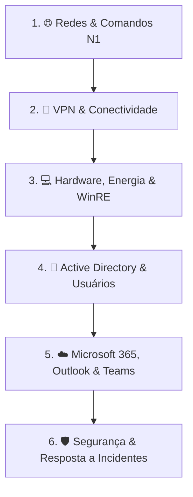

# 🧠 Deck de Flashcards Anki • ServiceDesk N1 (Iniciante)

Este material foi estruturado especificamente para **repetição espaçada no Anki**, cobrindo os conceitos fundamentais, comandos de terminal, atalhos do Windows e procedimentos padrão cobrados em entrevistas técnicas para **Suporte N1 / Help Desk**.

---

## 📥 Como Importar no Anki (Passo a Passo Rápido)

1. Abra o seu aplicativo do **Anki** (no computador ou no AnkiDroid/AnkiMobile).
2. Clique no menu **Arquivo (File)** ➔ **Importar (Import)**.
3. Selecione o arquivo **[`ANKI_FLASHCARDS_N1.txt`](file:///home/gabriel/Downloads/ServiceDeskLab/ANKI_FLASHCARDS_N1.txt)** gerado na raiz deste projeto.
4. Na tela de importação do Anki:
   - **Tipo**: `Básico` (Basic).
   - **Separador**: `Tabulação` (Tab).
   - **Permitir HTML**: Certifique-se de que a opção *Allow HTML in fields* esteja marcada.
5. Clique em **Importar**. Um deck organizado com tags por assunto será criado instantaneamente!

---

## 📚 Visão Geral dos Flashcards por Trilha Didática (Ordenados do Básico ao Prático)

---

### 1. 🌐 Trilha de Redes & Conectividade N1
| Tipo | Frente (Pergunta / Conceito) | Verso (Resposta Técnica N1) |
| :--- | :--- | :--- |
| **Comando** | O que faz `ipconfig` e quando usar? | Exibe IPv4, Máscara e Gateway Padrão. Primeiro comando em falhas de rede. |
| **Comando** | O que traz o `ipconfig /all` a mais? | Endereço MAC, Servidor DHCP, Servidores DNS e Lease Time. |
| **Comando** | O que fazem `ipconfig /release` e `/renew`? | Libera o IP atual e solicita um novo lease ao servidor DHCP (útil em conflitos). |
| **Comando** | O que faz `ipconfig /flushdns`? | Limpa o cache local de DNS corrompido no Windows. |
| **Conceito** | O que é o Gateway Padrão? | É o IP do Roteador que encaminha o tráfego da rede local para a internet. |
| **Conceito** | O que significa o IP `169.254.x.x` (APIPA)? | O computador não conseguiu resposta do DHCP. Solução: checar cabo e porta. |
| **Comando** | O que é e para que serve o `ping`? | Envia pacotes ICMP para medir conectividade, latência (ms) e perda de pacotes. |
| **Comando** | O que faz o comando `tracert`? | Mapeia todos os saltos (hops) de roteadores para achar onde a rota cai. |
| **Atalho** | Qual o comando para abrir Conexões de Rede? | `Win + R` ➔ `ncpa.cpl`. |
| **Troubleshooting** | Erro `ERR_PROXY_CONNECTION_FAILED` em home office? | Abrir `inetcpl.cpl` > Conexões > Configurações da LAN > desmarcar servidor proxy. |
| **Troubleshooting** | Cabo conectado negociando em 10 Mbps Half-Duplex? | Cabo RJ45 com pino quebrado/esmagado. Solução: trocar o patch cord por Gigabit. |

---

### 2. 🔑 Trilha de VPN N1
| Tipo | Frente (Pergunta / Conceito) | Verso (Resposta Técnica N1) |
| :--- | :--- | :--- |
| **Troubleshooting** | VPN falha autenticação com senha correta? | Verificar se o relógio do celular do MFA está no modo automático. |
| **Troubleshooting** | Erro *Virtual Adapter failure* no AnyConnect/FortiClient? | Abrir `ncpa.cpl` e **Ativar** a placa virtual da VPN (ou reiniciar serviço). |

---

### 3. 💻 Trilha de Hardware, Energia & WinRE N1
| Tipo | Frente (Pergunta / Conceito) | Verso (Resposta Técnica N1) |
| :--- | :--- | :--- |
| **Troubleshooting** | Notebook fora da tomada não liga (LEDs apagados)? | **Hard Reset (Power Drain)**: segurar o botão Power por 30s para drenar capacitores. |
| **Troubleshooting** | PC liga, cooler gira, mas monitor fica *Sem Sinal*? | Cabo de vídeo plugado na porta Onboard superior em vez da GPU dedicada inferior. |
| **Atalho** | Monitores da Dock Station USB-C pretos? | Atalho `Win + Ctrl + Shift + B` (reinicia o driver gráfico do Windows). |
| **Comando** | Como testar memória RAM nativamente? | Executar `mdsched.exe` (Diagnóstico de Memória do Windows). |
| **Atalho** | Como entrar no Modo de Segurança (WinRE)? | Segurar **SHIFT** ao clicar em **Reiniciar** (ou forçar desligamento 3x no Power). |
| **Conceito** | Onde o N1 localiza a chave BitLocker de 48 dígitos? | No portal do Microsoft Entra ID (Azure AD) ou Intune buscando pelo dispositivo. |

---

### 4. 🏢 Trilha de Active Directory N1
| Tipo | Frente (Pergunta / Conceito) | Verso (Resposta Técnica N1) |
| :--- | :--- | :--- |
| **Atalho** | Qual o comando para abrir o console do AD? | `Win + R` ➔ `dsa.msc` (Active Directory Users and Computers). |
| **Conceito** | O que é uma OU (Organizational Unit)? | Pasta lógica do AD para organizar usuários por setor e aplicar políticas (GPO). |
| **Operação** | Como fazer o desbloqueio de conta (Lockout)? | No `dsa.msc` > Propriedades > aba *Account* > marcar *Unlock account* e Aplicar. |
| **Operação** | Caixas obrigatórias no reset de senha do AD? | Marcar *"User must change password at next logon"* e desbloquear a conta. |
| **Operação** | Desativar (Disable) vs Excluir (Delete) conta? | **Sempre Desativar**: preserva o SID, histórico de e-mails e permissões de arquivos. |
| **Operação** | Adicionar usuário a grupo de segurança (Member Of)? | Aba *Member Of* > Adicionar grupo > Instruir usuário a fazer **Logoff e Logon**. |
| **Ferramenta** | O que é o RSAT e por que o N1 precisa dele? | Pacote de ferramentas remotas para gerenciar o AD do próprio notebook. |

---

### 5. ☁️ Trilha de Microsoft 365 & Colaboração N1
| Tipo | Frente (Pergunta / Conceito) | Verso (Resposta Técnica N1) |
| :--- | :--- | :--- |
| **Troubleshooting** | Outlook pedindo senha em loop a cada 2 minutos? | Limpar credenciais antigas do *MS.Outlook* no Gerenciador de Credenciais (`keymgr.dll`). |
| **Troubleshooting** | E-mails importantes caindo no Lixo Eletrônico? | Outlook > Opções de Lixo Eletrônico > aba **Remetentes Confiáveis** > Adicionar domínio. |
| **Troubleshooting** | Office com faixa vermelha de *Produto Não Licenciado*? | Word > Arquivo > Conta > Desconectar e relogar com e-mail corporativo. |
| **Troubleshooting** | Ninguém ouve o usuário nas reuniões do Teams? | Teams > Configurações > Dispositivos > Alterar entrada para **Headset USB**. |

---

### 6. 🛡️ Trilha de Segurança N1
| Tipo | Frente (Pergunta / Conceito) | Verso (Resposta Técnica N1) |
| :--- | :--- | :--- |
| **Incidente** | Usuário clicou em anexo de Phishing suspeito? | **Isolar o PC da rede imediatamente** (puxar cabo e desligar Wi-Fi), resetar senha e acionar SOC. |
| **Troubleshooting** | Erro de certificado `NET::ERR_CERT_DATE_INVALID`? | Data/hora do Windows desajustada. Solução: sincronizar relógio automático. |
