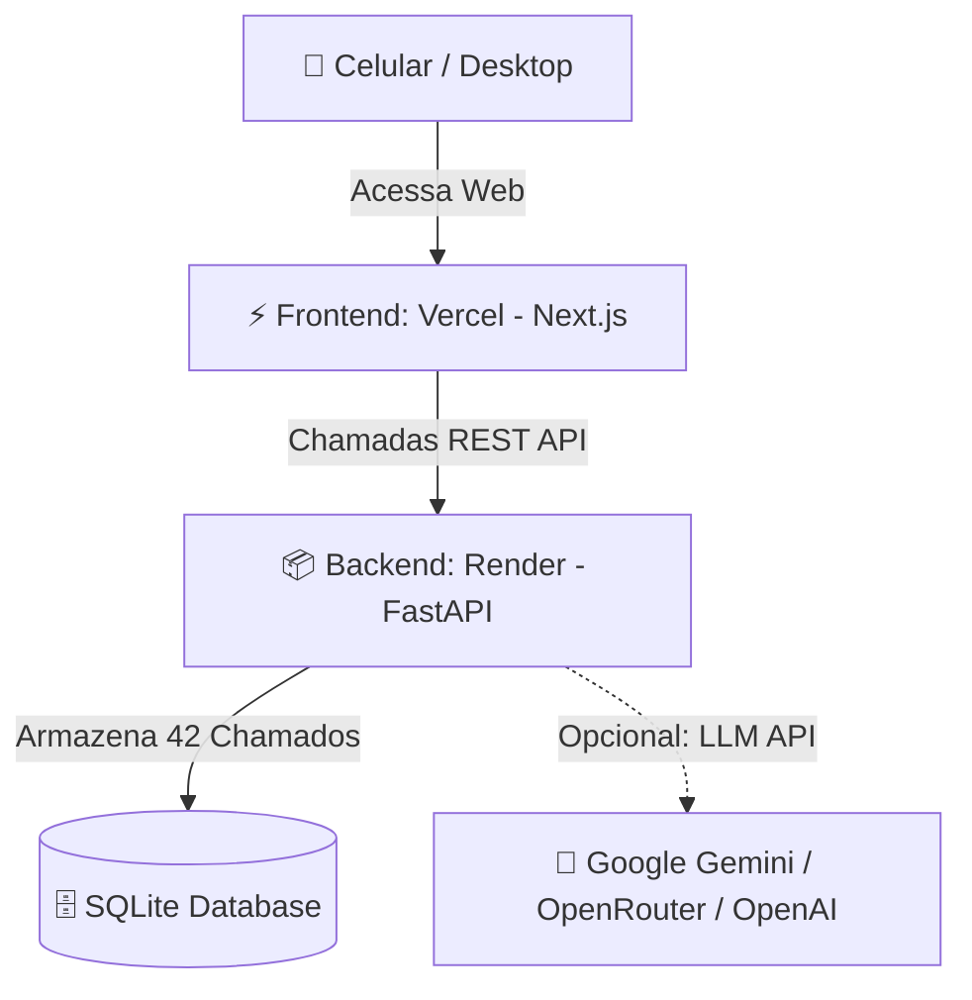

# 🚀 Guia de Deploy e Produção • ServiceDesk Lab

Este documento contém o passo a passo completo, detalhado e gratuito para colocar o **ServiceDesk Lab** em produção na nuvem (Vercel + Render), permitindo acesso online pelo celular, compartilhamento com recrutadores e uso de IAs generativas.

---

## 🏗️ 1. Arquitetura da Aplicação na Nuvem



| Camada | Tecnologia | Plataforma de Hospedagem (Grátis) |
| :--- | :--- | :--- |
| **Frontend** | Next.js 16 (App Router + Tailwind) | [Vercel.com](https://vercel.com) |
| **Backend** | Python 3 (FastAPI + SQLAlchemy) | [Render.com](https://render.com) (ou Railway / Koyeb) |
| **Simulação** | Motor Local Determinístico + Multi-LLM | Integrado (Google Gemini, OpenRouter, OpenAI, Mock) |

---

## ⏱️ 2. Tempo de Execução e Pré-requisitos

- **Tempo Total**: ~7 a 10 minutos.
- **Custo**: 100% Gratuito.
- **Pré-requisitos**:
  - Conta no [GitHub](https://github.com).
  - Conta no [Render.com](https://render.com) (login com GitHub).
  - Conta na [Vercel.com](https://vercel.com) (login com GitHub).

---

## 📦 3. Passo a Passo do Deploy

### Passo 1: Subir o Código para o GitHub
No terminal da pasta do projeto, envie a versão mais recente:

```bash
git add .
git commit -m "feat: ServiceDesk Lab v2.5 com 42 cenarios e configuracoes de deploy"
git push origin main
```

---

### Passo 2: Deploy do Backend no [Render.com](https://render.com)
1. Acesse o [Render Dashboard](https://dashboard.render.com/) e clique em **New +** ➔ **Web Service**.
2. Conecte o seu repositório `ServiceDeskLab`.
3. Preencha as configurações:
   - **Name**: `servicedesklab-api`
   - **Region**: Qualquer uma (ex: *Ohio (US East)* ou *Frankfurt*)
   - **Root Directory**: `backend`
   - **Runtime**: `Python 3`
   - **Build Command**:
     ```bash
     pip install -r requirements.txt && python seed.py
     ```
   - **Start Command**:
     ```bash
     uvicorn main:app --host 0.0.0.0 --port $PORT
     ```
   - **Instance Type**: `Free`
4. Clique em **Create Web Service**.
5. Aguarde cerca de 2 a 3 minutos. O Render gerará a sua URL pública do backend:
   > 📌 Exemplo: `https://servicedesklab-api.onrender.com`

---

### Passo 3: Deploy do Frontend na [Vercel.com](https://vercel.com)
1. Acesse a [Vercel](https://vercel.com/) e clique em **Add New...** ➔ **Project**.
2. Importe o repositório `ServiceDeskLab`.
3. Defina as configurações do projeto:
   - **Framework Preset**: `Next.js`
   - **Root Directory**: Clique em *Edit* e selecione a pasta **`frontend`**.
4. Expanda a seção **Environment Variables** e adicione:
   - **Key**: `NEXT_PUBLIC_API_URL`
   - **Value**: Cole a URL do backend gerada no Render (sem barra `/` no final):
     > Exemplo: `https://servicedesklab-api.onrender.com`
5. Clique em **Deploy**.
6. Em ~1 minuto a Vercel gerará o seu link de produção:
   > 📌 Exemplo: `https://servicedesklab.vercel.app`

---

## 🤖 4. Integração com Inteligência Artificial (Como Funciona)

A plataforma funciona em **dois modos independentes**:

### Modo A: 100% Gratuito e Offline (Padrão)
- **Não requer chave de API nem cadastros.**
- O backend possui um motor determinístico inteligente cobrindo todos os **42 cenários** de suporte (Redes, Hardware, Active Directory, M365, VPN e Segurança).
- Ideal para treinar rápido sem custos de API.

### Modo B: LLM Generativa Real (Google Gemini, OpenRouter, OpenAI)
- Se você quiser respostas abertas e avaliações personalizadas geradas por IA:
  1. No menu lateral do app (pelo celular ou PC), clique em **Motor de Simulação** (`/settings`).
  2. Selecione o provedor desejado:
     - **Google Gemini** (Recomendado - API gratuita no Google AI Studio).
     - **OpenRouter** (Acesso a modelos como Llama 3.3 e DeepSeek).
     - **OpenAI** (GPT-4o-mini).
  3. Cole sua chave de API e clique em **Salvar Configurações**.
  4. Pronto! Os clientes simulados passam a dialogar dinamicamente usando a IA configurada.

---

## 📱 5. Como Usar no Celular (Modo App / PWA)

O frontend foi desenvolvido com design 100% responsivo para smartphones e tablets:

1. Abra o link da Vercel (ex: `https://servicedesklab.vercel.app`) no navegador do seu smartphone (Chrome no Android ou Safari no iPhone).
2. **Transformar em Aplicativo**:
   - **No Android (Chrome)**: Clique nos 3 pontinhos do topo ➔ **"Instalar aplicativo"** ou **"Adicionar à tela inicial"**.
   - **No iPhone (Safari)**: Clique no botão de Compartilhar (ícone com quadrado e seta) ➔ **"Adicionar à Tela de Início"**.
3. O ícone do **ServiceDesk Lab** ficará salvo na grade de apps do seu celular, abrindo em tela cheia sem barras de navegação!

---

## 💼 6. Como Compartilhar no Currículo e LinkedIn

Você pode usar o link público do projeto para comprovar suas habilidades práticas em entrevistas de empresas como **Randstad, HCLTech, Stefanini e Dell**:

### Sugestão de Texto para o LinkedIn / Portfólio:
> **Projeto: ServiceDesk Lab • Plataforma de Treinamento e Simulação N1/N2**  
> Desenvolvi um ambiente prático interativo (estilo TryHackMe) focado em capacitação técnica para Help Desk e Service Desk.  
> 🔗 **Link Online**: `https://servicedesklab.vercel.app`  
> 💻 **Repositório**: `https://github.com/SEU-USUARIO/ServiceDeskLab`  
> 🛠️ **Habilidades Demonstradas**: Resolução de incidentes de Redes (VLAN, DHCP, DNS, Tracert, VPN), Hardware (BSOD, WinRE, Hard Reset), Active Directory (Onboarding, Lockout, GPO, RSAT), Microsoft 365 e Segurança.
